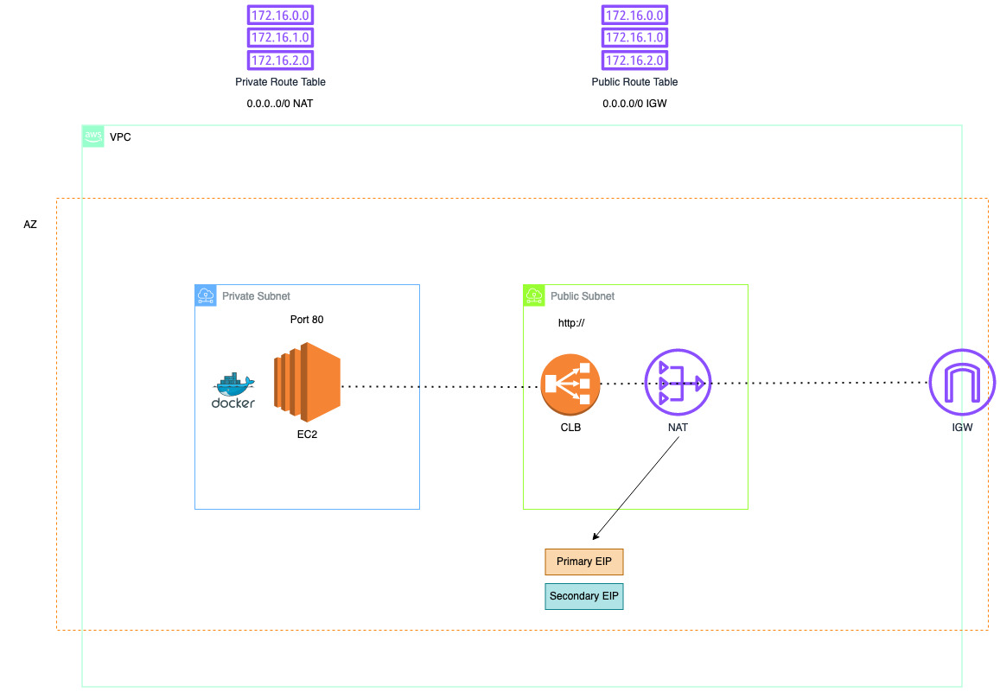

# Orbs Tech Test


This Terraform script provisions and manages a simple nginx web server running on an AWS EC2 instance. It includes a VPC, subnets, a NAT Gateway, security groups, Classic Load Balancer and an EC2 instance running Docker with a nginx web server.

## Installation

Please make sure Docker is installed on your local machine

clone the git repository

```
git clone 
```

set your AWS credentials
```
 export AWS_ACCESS_KEY_ID=your_access_key_id
 export AWS_SECRET_ACCESS_KEY=your_secret_access_key
 export AWS_SESSION_TOKEN=your_session_token  -  required if you are using temporary credentials.
```

run npm install to install the packages - optional

```
npm install
```

## Usage

```bash
 # build docker
 docker build -t terraform-aws-orbs:0.1 .

 # apply terrafrom
 docker run --rm -v $(pwd)/.state:/app/.state -e AWS_ACCESS_KEY_ID=$AWS_ACCESS_KEY_ID -e AWS_SECRET_ACCESS_KEY=$AWS_SECRET_ACCESS_KEY  -e AWS_SESSION_TOKEN=$AWS_SESSION_TOKEN terraform-aws-orbs:0.1

 # destroy terrafrom
 docker run --rm -v $(pwd)/.state:/app/.state -e AWS_ACCESS_KEY_ID=$AWS_ACCESS_KEY_ID -e AWS_SECRET_ACCESS_KEY=$AWS_SECRET_ACCESS_KEY  -e AWS_SESSION_TOKEN=$AWS_SESSION_TOKEN terraform-aws-orbs:0.1 destroy
  
 # delete docker container  
 docker rm terraform-aws-container 
```

## Pre-commit hooks

Husky is installed which runs commitlint, tflint and tfsec on the terrafom directory prior to commiting and pushing the code to the repository.

you can also run these from the command line using npm 

```shell
npm run lint
npm run security
```

This will trigger a docker container to run tfsec and tflint.

## Testing the application

The application maybe take upto 20 seconds afther the installation completes. This is due to the install scrpipt checking for external connectivity before it installs Docker and Ngnix webserver.

To test the application, hit the LB dns name provided as a TF output in the browser

```

Outputs:

alb_dns_name = "web-elb-<account_id>.eu-west-2.elb.amazonaws.com"

```

## Architecture



## Design Decisions 

   * AWS Region: Chosen eu-west-2 for this example.

   * AMI: Used Amazon Linux 2 AMI for the EC2 instance.

   * Instance Type: Selected t2.micro for cost efficiency during testing and development.

   * Subnets: Configured 1 public and 1 private subnet for the purposes of this exercise.

   * NAT Gateway: Used 1 NAT Gateway with a secondary IP for scalability.

   * Load Balancer: As we only have 1 public subnet, a Classic Load Balancer is used. (ALB and NLB require a minimum 
    of 2 subnets).

   * LB Ingress is open to the all for the purposes of this exercise. However, for a production environment this 
    should be either locked down to a known cidr range or be placed behind a firewall/WAF.

   * EC2 Ingress only allows port 80 for http traffic and 443 for session manger console access to the EC2 instance. For Egress, i've allowed all traffic out for installation of the docker and nginx packages. 


## Improvments

   Running a tfsec scan hightlights some critical security risks. 

   * Prevent EC2 egress to 0.0.0./0. Locking this down should be a priority in non lab/sandbox environments. There 
   are solutions available such as an S3 VPCEndpoint which allows you to download yum packages from AWS directly. 
   This does not require internet access and    uses Private Link allowing you to lock down the cidr range. If this 
   needs to be open, then a firewall should be used to restict external access.
   * Encryption - EC2 EBC volumes should be encrypted to prevent loss of data. This comes with associated costs but 
   is AWS standard best proactice.
   * HTTP protocol should not be used where possiile and a TLS public certiciate should be used. This could have 
   cost implications.


## License

[MIT](https://choosealicense.com/licenses/mit/)